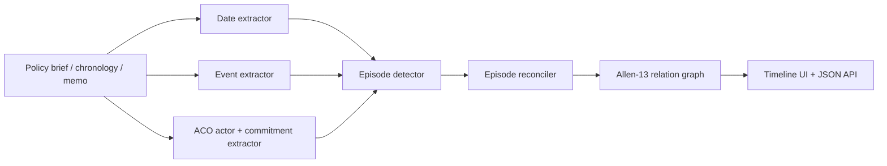
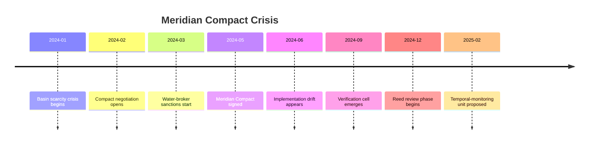
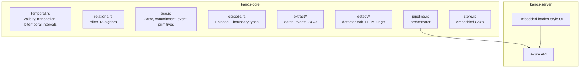

# KAIROS

**Temporal vision for policy intelligence.** KAIROS is a Rust-first TACITUS tool that turns long-form prose into dates, events, actors, commitments, canonical episodes, and Allen-13 temporal relations.

It is built for the problem normal LLM summaries flatten: policy time is not a list. Sanctions overlap negotiations. Leadership tenures contain crises. Review windows meet implementation phases. Commitments drift, expire, restart, or become institutions. KAIROS gives downstream agents a structured time scene instead of a paragraph blur.

```text
TACITUS // KAIROS
temporal perception -> episode graph -> policy reasoning
```

## What It Does



KAIROS outputs:

- `dates`: character spans, resolved timestamps, fuzziness.
- `events`: canonical temporal events with anchors.
- `actors`: TACITUS ACO actor primitives.
- `commitments`: who committed what, to whom, in what state.
- `episodes`: coherent intervals with boundaries, anchors, confidence, and review state.
- `relations`: pairwise Allen-13 temporal relations.

## Why It Matters



KAIROS is designed to become a backbone for TACITUS products:

- PRAXIS can reason about crisis windows, implementation slippage, and review phases.
- DIALECTICA can ground arguments in what was true before, during, and after an episode.
- TACITUS analysis agents can query temporal structure instead of re-reading raw text.

## Rust Architecture



Core invariants:

- One deployable binary.
- Fast Rust interval and relation logic.
- Embedded static UI.
- Embedded CozoDB, no external database for the MVP.
- Gemini, Ollama, and deterministic mock modes.
- Request-scoped Gemini key testing from the UI.

## Run Locally

```bash
cargo run --release --bin kairos-server
```

Open `http://localhost:8080`, click `Load demo text`, then `Analyze`.

For deterministic local demo/CI:

```bash
export KAIROS_LLM=mock
cargo run --release --bin kairos-server
```

For server-side Gemini:

```bash
export GEMINI_API_KEY="..."
export KAIROS_GEMINI_MODEL="gemini-2.5-flash"
cargo run --release --bin kairos-server
```

You can also paste a Gemini API key into the web UI for a single analysis run. The key is sent only in that `/api/analyze` request, is not saved by the browser, is not stored by the server, and is not included in exported JSON.

## API

```bash
curl -s -X POST http://localhost:8080/api/analyze \
  -H 'Content-Type: application/json' \
  -d '{
    "text": "January 15, 2024: Riverdale announces rationing. March 12, 2024: leadership changes.",
    "gemini_api_key": "optional-per-request-key",
    "gemini_model": "gemini-2.5-flash"
  }'
```

Response shape:

```json
{
  "session_id": "sess_...",
  "dates": [],
  "events": [],
  "actors": [],
  "commitments": [],
  "episodes": [],
  "relations": []
}
```

`gemini_api_key` and `gemini_model` are optional and request-scoped. When a key is present, that analysis uses Gemini even if the deployed server default is mock mode.

## Demo Gate

The built-in Meridian Compact Crisis mock demo currently returns:

```text
23 dates
17 events
7 actors
6 commitments
8 episodes
56 Allen relations
42 non-trivial relations
```

That is the minimum public demo posture: it should visibly prove overlapping temporal structure, not just chronology extraction.

## Deploy To Cloud Run

```bash
export PROJECT_ID="your-project-id"
export GEMINI_API_KEY="..."
./deploy.sh
```

For a no-key deterministic Cloud Run demo:

```bash
PROJECT_ID="your-project-id" KAIROS_LLM=mock ./deploy.sh
```

The deploy script enables required APIs, creates Artifact Registry if needed, stores the Gemini key in Secret Manager for Gemini mode, builds with Cloud Build, deploys Cloud Run, and then disables the Cloud Run Invoker IAM check for public testing when permitted.

## Verification

```bash
cargo fmt --all --check
cargo test --release
cargo build --release
```

Read more:

- `docs/ARCHITECTURE.md` explains the Rust crates, temporal model, Allen-13 relation layer, and learning path.
- `docs/CAPABILITY_MAP.md` tracks what is live now and what turns KAIROS into a TACITUS backbone.
- `examples/demo-text.md` contains the Meridian Compact Crisis.

## License

Apache-2.0. Copyright 2026 TACITUS.
