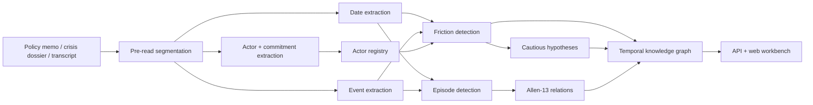

# KAIROS

**Rust-first temporal vision for [TACITUS](https://www.tacitus.me).**

KAIROS turns long-form political, legal, diplomatic, and institutional text into a **temporal knowledge graph**: dated events, canonical actors, commitments, friction, hypotheses, episodes, Allen-13 temporal relations, and source-grounded evidence spans.

> ⚠️ **Experimental work in progress.** MVP+ library and demo, breaking changes possible.
> **Feedback, issues, PRs welcome** — see [Status & how to engage](#status--how-to-engage).

## 30-Second Read

- **What it is**: a Rust temporal extraction engine for policy, legal, diplomatic, and institutional text.
- **What it proves today**: deterministic temporal parsing, event and commitment extraction, episode grouping, Allen-13 relation output, graph export, and a demo UI/API.
- **What it is not yet**: a production decision system, a legal analysis product, or a full PRAXIS/DIALECTICA replacement.
- **Best place to start**: run the deterministic mock mode in [Quick Start](#quick-start), then read [SPEC.md](SPEC.md) and [ROADMAP.md](ROADMAP.md).

```text
TACITUS → KAIROS
raw prose → conflict vision → temporal graph → policy reasoning
```

---

## Why this exists

Most AI systems flatten time. They summarize a dossier as a sequence of events and lose the structure that actually matters:

- Sanctions can overlap negotiations.
- Court rulings can interrupt enforcement without ending it.
- Leaders change while institutions preserve old commitments.
- Review windows can meet implementation phases.
- Delay can be administrative, political, legal, or strategic.
- Trust can degrade before anyone says "conflict" explicitly.

**KAIROS gives TACITUS systems a computable scene instead of a paragraph summary.** PRAXIS can reason about crisis windows and implementation slippage. DIALECTICA can ground arguments in what was true before, during, and after an episode.

---

## What KAIROS produces

Given a document, `AnalysisResult` includes:

| Field | What it is |
|---|---|
| `pre_read` | Document type, segments, speaker turns, chronology blocks, tension markers |
| `dates` | Temporal mentions with spans, resolution, fuzziness, date kind |
| `events` | Canonical events with timestamps and source spans |
| `actors` + `actor_registry` | Canonical actors with deterministic aliases |
| `commitments` | Who committed what, to whom, in what state |
| `frictions` | Conflict/cooperation/ambiguity signals with mechanism, trajectory, evidence grade |
| `hypotheses` | Cautious inference objects citing supporting friction |
| `episodes` | Coherent temporal intervals with boundaries, anchors, confidence |
| `relations` | Allen-13 relations between episodes |
| `source_index` | Object-to-span and object-to-segment lookups |
| `graph` | Typed nodes + edges for everything above |
| `diagnostics` | Warnings, counts, unresolved dates, confidence summary |

---

## The TACITUS Trinity — how KAIROS fits

KAIROS is one of three repos in the TACITUS conflict-intelligence stack. **It is fully usable on its own** — paste a dossier, get a temporal graph, done.

| Repo | Role | When you'd use it |
|---|---|---|
| **KAIROS** (this repo) | Temporal engine | You need a temporal knowledge graph with Allen-13 relations + commitment state |
| [**AGON**](https://github.com/sargonxg/AGON) | Evidence engine | You need claim verification + contradiction detection + friction maps |
| [**DIALECTICA**](https://github.com/sargonxg/A3_DIALECTICAbyTACITUS_v3) | Capsule and reasoning core | You want source-grounded context capsules, ontology blueprints, graph outputs, and review gates |

```
text → KAIROS (when, in what order, what's still pending)
        ↓
       DIALECTICA (ontology + reasoning) → AGON (evidence verification) → graph → praxis.tacitus.me
```

In the wired stack, KAIROS runs as a **pre-pass** on DIALECTICA's extraction pipeline. KAIROS extracts dates, events, commitments, and episodes; DIALECTICA's Gemini extractor then operates over that scaffold instead of raw text — dramatically better recall + precision on relationships.

📖 **Integration direction:** see the current DIALECTICA v3 repository: [`A3_DIALECTICAbyTACITUS_v3`](https://github.com/sargonxg/A3_DIALECTICAbyTACITUS_v3).

KAIROS's API contract (`POST /api/v1/analyze`) is the integration surface. The AGON-side mirror of the shared `tacitus-contracts` types lives at [`docs/INTEROP.md`](docs/INTEROP.md) (planned).

---

## Live demo

```text
http://34.54.231.53
```

The demo loads the Meridian Compact crisis dossier — a synthetic but realistic conflict-governance case with dated entries, transcript excerpts, legal blockage, missed deadlines, leadership transition, trust loss, and competing explanations.

The deterministic demo proves at least:

| | Count |
|---|---|
| Dates | 30+ |
| Events | 25+ |
| Actors | 10+ |
| Commitments | 10+ |
| Friction objects | 10+ |
| Hypotheses | 3+ |
| Episodes | 10+ |
| Allen relations | 80+ |

Paste your own text with a Gemini API key from the UI — the key is used for that single request, not stored, not exported.

---

## Architecture



**Core design choices:**

- Deterministic Rust owns dates, source spans, diagnostics, relations, graph assembly, and mock behavior
- LLMs refine structured extraction but do not define the architecture
- Gemini is one provider path, not the product boundary
- Public API: one simple `AnalysisRequest`, one rich `AnalysisResult`
- Graph IDs are stable strings; heavier graph storage comes later when mutation pressure is real

---

## Quick Start

```bash
# Deterministic mock mode (no LLM key needed)
KAIROS_LLM=mock cargo run --release --bin kairos-server
# → http://localhost:8080

# With server-side Gemini
GEMINI_API_KEY="..." KAIROS_LLM=gemini cargo run --release --bin kairos-server
```

You can also leave the server in mock mode and paste a Gemini key into the UI for a single browser-initiated analysis.

---

## API

```bash
# Full analysis
curl -X POST http://localhost:8080/api/v1/analyze \
  -H 'Content-Type: application/json' \
  -d '{
    "text": "January 15, 2024: Riverdale announces rationing. March 12: leadership changes.",
    "document_id": "case-001",
    "document_created_at": "2024-03-12T00:00:00Z",
    "analysis_mode": "auto"
  }'

# Graph only
curl -X POST http://localhost:8080/api/v1/graph -H 'Content-Type: application/json' -d '{...}'

# Validate an existing graph
curl -X POST http://localhost:8080/api/v1/validate -H 'Content-Type: application/json' -d '{...}'
```

**Request fields:**
- `text` (required)
- `document_id` (recommended for source-span traceability)
- `document_created_at` (helps resolve relative dates)
- `analysis_mode`: `auto` | `single` | `dossier` | `corpus`
- `gemini_api_key`, `gemini_model` (optional request-scoped overrides)

---

## Status & how to engage

KAIROS is **experimental work in progress** — an MVP-plus library and demo service. Usable today for deterministic demos, local development, and real Gemini-backed extraction experiments.

**Comments welcome — preferred channels:**
- 💬 **[GitHub Discussions](https://github.com/sargonxg/KAIROS-temporal-vision-TACITUS/discussions)** — ideas, questions, temporal edge cases worth handling
- 🐛 **[Issues](https://github.com/sargonxg/KAIROS-temporal-vision-TACITUS/issues)** — bugs, date-resolution misses, Allen-relation surprises
- 📬 **[tacitus.me](https://www.tacitus.me)** — direct contact
- 🔀 **PRs** — golden-fixture tests required for any extraction or relation change; see [`ROADMAP.md`](ROADMAP.md) for priorities

If you run a real policy/legal/diplomatic document through KAIROS and the temporal structure surprises you, that's the most useful feedback.


**Live now:**
- Rust workspace with `kairos-core` + `kairos-server`
- Embedded Axum web workbench
- Deterministic mock mode for CI and public demos
- Request-scoped Gemini key testing from the browser
- Pre-read segmentation and tension-marker detection
- Actor canonicalization and alias registry
- Actors, commitments, events, friction, episodes, hypotheses, graph
- Allen-13 temporal relations
- `/api/analyze`, `/api/v1/analyze`, `/api/v1/graph`, `/api/v1/validate`
- Source-span indexing for evidence traceability
- Cloud Run deployment path

**Roadmap (standalone KAIROS):**
- Persistent multi-document memory
- True corpus-level graph merge
- Production-grade cross-document coreference
- Full TimeML import/export
- Trained local neural models for date extraction
- PyO3/WASM packaging for in-process embedding

**Trinity integration:**
- Adopt `tacitus-contracts` shared schemas (Event, Actor, Commitment, AllenRelation)
- Publish `kairos-core` ↔ contracts mapping ([`docs/INTEROP.md`](docs/INTEROP.md), planned)
- Stabilize `POST /api/v1/analyze` for DIALECTICA's `temporal_scaffold` pipeline node
- Optional gRPC server for lower-latency integration
- Cross-service trace propagation (`X-Trace-Id`)

📖 See [`ROADMAP.md`](ROADMAP.md) for the full plan + sequencing.

---

## Access control

Optional HTTP Basic Auth for the deployed workbench:

```bash
KAIROS_BASIC_USER="kairos"
KAIROS_BASIC_PASSWORD="change-this-password"
```

`/healthz` stays public for load balancers. If either variable is missing, auth is disabled.

---

## Repository layout

```text
.
├── crates/
│   ├── kairos-core/        # Rust library: pipeline, models, extraction, graph, diagnostics
│   └── kairos-server/      # Axum server with embedded static frontend
├── docs/                   # Architecture, capability map, research plan, roadmap
├── examples/
│   ├── demo-text.md        # Meridian Compact dossier
│   └── eval/               # Regression fixtures
├── scripts/
│   └── kairos-smoke.ps1    # Public smoke test
├── web/                    # Frontend workbench
├── deploy.sh               # Cloud Run deployment script
├── BUILD.md                # Build + deployment playbook
└── README.md
```

---

## Deployment

```bash
# Deterministic mode
PROJECT_ID="kairos-temporal-tacitus" KAIROS_LLM=mock ./deploy.sh

# Gemini-backed
PROJECT_ID="kairos-temporal-tacitus" KAIROS_LLM=gemini GEMINI_API_KEY="..." ./deploy.sh

# Password-protected
PROJECT_ID="kairos-temporal-tacitus" \
KAIROS_LLM=mock \
KAIROS_BASIC_USER="kairos" \
KAIROS_BASIC_PASSWORD="change-this-password" \
./deploy.sh
```

The deploy script enables required Google Cloud APIs, builds with Cloud Build, pushes to Artifact Registry, deploys Cloud Run, and configures public access where org policy permits.

---

## Verification

```bash
cargo fmt --all --check
cargo test --release
cargo build --release
node --check web/app.js
powershell -ExecutionPolicy Bypass -File scripts/kairos-smoke.ps1 -BaseUrl http://localhost:8080
```

The smoke script expects a running server (`KAIROS_LLM=mock cargo run --release --bin kairos-server`).

---

## Security and privacy

- Browser Gemini key field is request-scoped
- Optional `KAIROS_BASIC_USER`/`KAIROS_BASIC_PASSWORD` protect the frontend + API
- Keys are not persisted by the frontend
- Request-scoped keys are not serialized in `AnalysisResult`
- Deterministic demo runs with no LLM provider
- Real case text sent to `/api/analyze` is processed by the configured provider — **do not send sensitive material to a hosted LLM unless authorized**

See [`SECURITY.md`](SECURITY.md) for vulnerability reporting.

---

## Contributing

KAIROS is early-stage TACITUS infrastructure. Contributions should preserve the central contract: **simple user-facing API, serious Rust core, source-grounded outputs, honest capability claims.**

Start with:
- [`CONTRIBUTING.md`](CONTRIBUTING.md)
- [`docs/ARCHITECTURE.md`](docs/ARCHITECTURE.md)
- [`docs/CAPABILITY_MAP.md`](docs/CAPABILITY_MAP.md)
- [`docs/DEEP_TECH_MVP_BUILD_PLAN.md`](docs/DEEP_TECH_MVP_BUILD_PLAN.md)

---

## License

Apache-2.0. Copyright 2026 TACITUS.

```text
TACITUS — tools for institutions that need clearer judgment under pressure.
DIALECTICA — reasoning core    AGON — evidence engine    KAIROS — temporal engine
PRAXIS — conflict intelligence SaaS    CONCORDIA — voice-first mediation
https://www.tacitus.me
```
