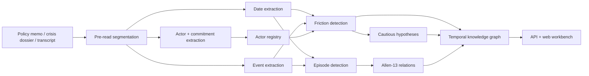

# KAIROS

Rust-first conflict vision for TACITUS.

KAIROS turns long-form political, legal, diplomatic, and institutional text into a temporal knowledge graph: dated events, canonical actors, commitments, friction, hypotheses, episodes, Allen-13 temporal relations, and source-grounded evidence spans.

It is part of the broader TACITUS mission at [tacitus.me](https://www.tacitus.me): build serious analytical infrastructure for policy, diplomacy, governance, conflict analysis, and institutional decision support. TACITUS products need more than summarization. They need systems that can see when a claim was true, which actor owned it, when a commitment slipped, which legal or political blockage changed the trajectory, and what evidence supports the inference.

```text
TACITUS -> KAIROS
raw prose -> conflict vision -> temporal graph -> policy reasoning
```

## Why This Exists

Most AI systems flatten time. They summarize a dossier as a sequence of events and lose the structure that actually matters:

- sanctions can overlap negotiations;
- court rulings can interrupt enforcement without ending it;
- leaders can change while institutions preserve old commitments;
- review windows can meet implementation phases;
- delay can be administrative, political, legal, or strategic;
- trust can degrade before anyone says "conflict" explicitly.

KAIROS is designed to give TACITUS systems a computable scene instead of a paragraph summary. PRAXIS can reason about crisis windows and implementation slippage. DIALECTICA can ground arguments in what was true before, during, and after an episode. Future TACITUS agents can query temporal structure instead of repeatedly re-reading raw text.

## Current Status

KAIROS is an MVP-plus library and demo service. It is usable today for deterministic demos, local development, and real Gemini-backed extraction experiments, but it is not yet a persistent multi-document production memory system.

Live now:

- Rust workspace with `kairos-core` and `kairos-server`.
- Embedded Axum web workbench.
- Deterministic mock mode for repeatable CI and public demos.
- Request-scoped Gemini key testing from the browser.
- Pre-read segmentation and tension-marker detection.
- Actor canonicalization and alias registry.
- Actor, commitment, event, friction, episode, hypothesis, and graph outputs.
- Allen-13 temporal relation computation.
- `/api/analyze`, `/api/v1/analyze`, `/api/v1/graph`, and `/api/v1/validate`.
- Source-span indexing for evidence traceability.
- Cloud Run deployment path.

Still roadmap:

- persistent multi-document memory;
- true corpus-level graph merge;
- production-grade cross-document coreference;
- full TimeML import/export;
- trained local neural models;
- PyO3/WASM packaging.

## Demo

Public demo:

```text
http://34.54.231.53
```

The demo loads the Meridian Compact crisis dossier, a synthetic but realistic conflict-governance case containing dated entries, transcript excerpts, legal blockage, missed deadlines, leadership transition, trust loss, and competing explanations.

The deterministic demo currently proves at least:

```text
30+ dates
25+ events
10+ actors
10+ commitments
10+ friction objects
3+ hypotheses
10+ episodes
80+ Allen relations
```

With a Gemini API key pasted into the UI, users can analyze their own case text. The key is used for that single request, is not stored by the browser or server, and is not included in exported JSON.

## Repository Layout

```text
.
├── crates/
│   ├── kairos-core/        # Rust library: pipeline, models, extraction, graph, diagnostics
│   └── kairos-server/      # Axum server with embedded static frontend
├── docs/                   # Architecture, capability map, research plan, roadmap
├── examples/
│   ├── demo-text.md        # Large Meridian Compact dossier
│   └── eval/               # Focused regression fixtures
├── scripts/
│   └── kairos-smoke.ps1    # Public smoke test
├── web/                    # Simple frontend workbench
├── deploy.sh               # Cloud Run deployment script
├── BUILD.md                # Build and deployment playbook
└── README.md
```

## Architecture



Core design choices:

- Deterministic Rust owns dates, source spans, diagnostics, relations, graph assembly, and mock behavior.
- LLMs refine structured extraction but do not define the whole architecture.
- Gemini is one provider path, not the product boundary.
- The public API keeps one simple `AnalysisRequest` and one rich `AnalysisResult`.
- Graph IDs are stable strings for now; heavier graph storage can come later when mutation pressure is real.

## Output Model

`AnalysisResult` includes:

- `pre_read`: document type, segments, speaker turns, chronology blocks, tension markers, inferred creation time.
- `dates`: temporal mentions with spans, resolution, fuzziness, and date kind.
- `events`: canonical events with timestamps and optional source spans.
- `actors`: extracted actor primitives.
- `actor_registry`: canonical actors and deterministic aliases.
- `commitments`: who committed what, to whom, and in what state.
- `frictions`: conflict/cooperation/ambiguity signals with mechanism, directness, evidence grade, trajectory, competing hypotheses, and source evidence.
- `hypotheses`: cautious inference objects that cite supporting friction and never overwrite extracted facts.
- `episodes`: coherent temporal intervals with boundaries, anchors, confidence, and review state.
- `relations`: Allen-13 relations between episodes.
- `source_index`: object-to-span and object-to-segment lookup.
- `graph_summary`: graph node and edge counts by type.
- `graph`: document, source-span, actor, alias, event, timex, commitment, friction, episode, contradiction, and hypothesis nodes with typed edges.
- `diagnostics`: warnings, relation counts, unresolved dates, friction posture, and confidence summary.

## Quick Start

Requirements:

- Rust toolchain from `rust-toolchain.toml`.
- Node.js only for `node --check web/app.js`.
- PowerShell for the smoke script on Windows.

Run the deterministic local demo:

```bash
KAIROS_LLM=mock cargo run --release --bin kairos-server
```

Open:

```text
http://localhost:8080
```

For server-side Gemini:

```bash
GEMINI_API_KEY="..." KAIROS_LLM=gemini cargo run --release --bin kairos-server
```

You can also leave the server in mock mode and paste a Gemini key into the UI for a single browser-initiated analysis.

## API

Analyze text:

```bash
curl -s -X POST http://localhost:8080/api/v1/analyze \
  -H 'Content-Type: application/json' \
  -d '{
    "text": "January 15, 2024: Riverdale announces rationing. March 12, 2024: leadership changes.",
    "document_id": "case-001",
    "document_created_at": "2024-03-12T00:00:00Z",
    "analysis_mode": "auto"
  }'
```

Export only the graph:

```bash
curl -s -X POST http://localhost:8080/api/v1/graph \
  -H 'Content-Type: application/json' \
  -d '{"text":"January 15, 2024: Riverdale announces rationing."}'
```

Validate an already extracted graph:

```bash
curl -s -X POST http://localhost:8080/api/v1/validate \
  -H 'Content-Type: application/json' \
  -d '{"dates":[],"commitments":[],"episodes":[],"relations":[]}'
```

Request fields:

- `text` is required.
- `document_id` is optional but recommended for source-span traceability.
- `document_created_at` is optional and helps resolve relative dates.
- `analysis_mode` accepts `auto`, `single`, `dossier`, and `corpus`.
- `gemini_api_key` and `gemini_model` are optional request-scoped overrides.

## Verification

Run before pushing:

```bash
cargo fmt --all --check
cargo test --release
cargo build --release
node --check web/app.js
powershell -ExecutionPolicy Bypass -File scripts/kairos-smoke.ps1 -BaseUrl http://localhost:8080
```

The smoke script expects a running server. For deterministic smoke testing:

```bash
KAIROS_LLM=mock cargo run --release --bin kairos-server
```

## Deployment

Cloud Run deployment:

```bash
PROJECT_ID="kairos-temporal-tacitus" KAIROS_LLM=mock ./deploy.sh
```

Gemini-backed deployment:

```bash
PROJECT_ID="kairos-temporal-tacitus" KAIROS_LLM=gemini GEMINI_API_KEY="..." ./deploy.sh
```

The deploy script enables required Google Cloud APIs, builds the container with Cloud Build, pushes to Artifact Registry, deploys the Cloud Run service, and configures public access where org policy permits it.

## Security And Privacy

- The browser Gemini key field is request-scoped.
- Keys are not persisted by the frontend.
- Request-scoped keys are not serialized in `AnalysisResult`.
- The deterministic demo can run with no LLM provider or external key.
- Real case text sent to `/api/analyze` is processed by the configured provider. Do not send sensitive material to a hosted LLM unless you are authorized to do so.

See [SECURITY.md](SECURITY.md) for vulnerability reporting and operational guidance.

## Contributing

KAIROS is early-stage TACITUS infrastructure. Contributions should preserve the central contract: simple user-facing API, serious Rust core, source-grounded outputs, and honest capability claims.

Start with:

- [CONTRIBUTING.md](CONTRIBUTING.md)
- [docs/ARCHITECTURE.md](docs/ARCHITECTURE.md)
- [docs/CAPABILITY_MAP.md](docs/CAPABILITY_MAP.md)
- [docs/DEEP_TECH_MVP_BUILD_PLAN.md](docs/DEEP_TECH_MVP_BUILD_PLAN.md)

## License

Apache-2.0. Copyright 2026 TACITUS.
